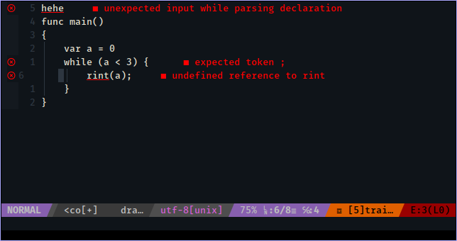

## draco-nvim

This is *very* PoC.



### vim-plug
```
Plug 'draco-lang/draco-nvim'
```

### Get started
In your project directory,
```
:DracoPullServer
:DracoBuildServer
:DracoRunServer
```

Next time opening a file it should work automatically.
